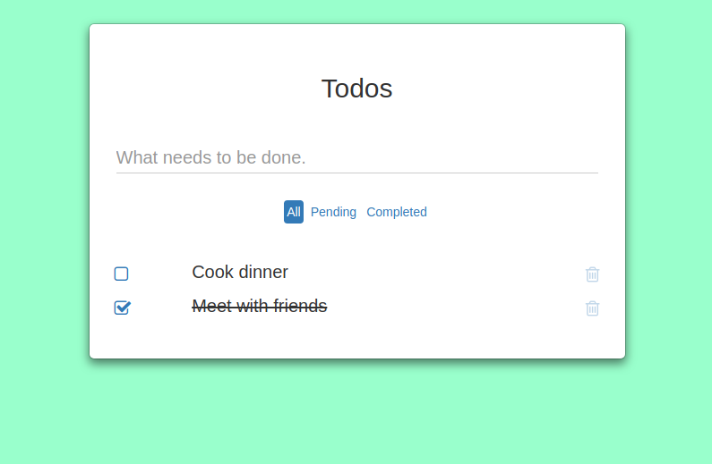

# react-todo

A simple todo application using the [create-react-app-boilerplate](https://github.com/ronneljamesbote/create-react-app-boilerplate).



## Getting Started

### Installing

Run the command below to install node packages

```
npm install
```

or

```
yarn install
```

### Running

To start the application run the command below, open a browser and go to `http://localhost:3000`

```
npm start
```

or

```
yarn start
```

## License

This project is licensed under the MIT License - see the [LICENSE.md](LICENSE.md) file for details.
